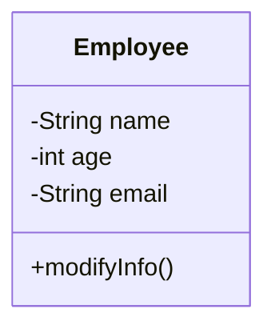

> 我们在阅读开源项目时，总是希望能比较高效的整理清楚项目中的各个类之间的关系，那么有没有相应的工具能高效、简洁的表示清楚类关系呢？UML类图就是一个可以帮我们解决此类问题的工具或者方法。

## UML

>  统一建模语言（Unified Modeling Language，缩写UML）是非专利的第三代建模和规约语言。
> UML是一种开放的方法，用于说明、可视化、构建和编写一个正在开发的、面向对象的、软件密集系统的制品的开放方法。这个语言由[葛来迪·布区](https://zh.wikipedia.org/wiki/葛來迪·布區)，[伊瓦尔·雅各布森](https://zh.wikipedia.org/wiki/伊瓦爾·雅各布森)与[詹姆士·兰宝](https://zh.wikipedia.org/wiki/詹姆士·蘭寶)于1994年至1995年间，在[Rational Software](https://zh.wikipedia.org/w/index.php?title=Rational_Software&action=edit&redlink=1)公司中开发，于1996年，又进一步发展。UML集成了[Booch](https://zh.wikipedia.org/w/index.php?title=Booch&action=edit&redlink=1)，[OMT](https://zh.wikipedia.org/w/index.php?title=对象建模技术&action=edit&redlink=1)和[面向对象程序设计](https://zh.wikipedia.org/wiki/面向对象程序设计)的概念，将这些方法融合为单一的，通用的，并且可以广泛使用的建模语言。UML打算成为可以对并发和分布式系统的标准建模语言。

首先要注意的是 UML 涉及很多不同的图表（模型），其原因是提供从许多不同的角度来审视系统。软件开发流程往往有许多持分者参与其中，例如：

- 分析师
- 设计师
- 程序员
- 测试员
- 质量保证员
- 客户
- 技术文件撰稿员

这些人都对系统的不同方面各持不同兴趣，故此在建模时需要考虑不同的细节层次。例如，程序员需要了解系统的设计，并将设计转换为代码，而技术文件撰稿员则对整个系统的行为感兴趣，借以了解产品的功能。UML 提供了极富表达能力的建模语言，好让各持分者至少可以从一个 UML 图表得到感兴趣的资讯。

UML系统开发中有三个主要的模型:

1. **功能模型**：从用户的角度展示系统的功能，包括用例图。
2. **对象模型**：采用对象，属性，操作，关联等概念展示系统的结构和基础，包括类别图、对象图。
3. **动态模型**：展现系统的内部行为。包括序列图，活动图，状态图。

UML可以分类为下方的结构。

- 结构性图形（*Structure diagrams*）强调的是系统式的建模：
  - 静态图（static diagram）
    - 类图
    - [对象图](https://zh.wikipedia.org/w/index.php?title=对象图&action=edit&redlink=1)
    - [包图](https://zh.wikipedia.org/w/index.php?title=包图&action=edit&redlink=1)
  - 实现图（implementation diagram）
    - [组件图](https://zh.wikipedia.org/wiki/组件图)
    - [部署图](https://zh.wikipedia.org/w/index.php?title=部署图&action=edit&redlink=1)
  - [剖面图](https://zh.wikipedia.org/w/index.php?title=剖面图&action=edit&redlink=1)
  - [复合结构图](https://zh.wikipedia.org/wiki/复合结构图)

- 行为式图形（*Behavior diagrams*）强调系统模型中触发的事件：
  - [活动图](https://zh.wikipedia.org/wiki/活动图)
  - [状态图](https://zh.wikipedia.org/wiki/状态图)
  - [用例图](https://zh.wikipedia.org/wiki/用例图)
  - 交互性图形（*Interaction diagrams*），属于行为图形的子集合，强调系统模型中的资料流程：
    - [通信图](https://zh.wikipedia.org/w/index.php?title=通信图&action=edit&redlink=1)
    - [交互概述图](https://zh.wikipedia.org/wiki/交互概述圖)（UML 2.0）
    - [时序图](https://zh.wikipedia.org/wiki/时序图)（UML 2.0）
    - [时间图](https://zh.wikipedia.org/w/index.php?title=时间图&action=edit&redlink=1)（UML 2.0）

### 类图

类图是一切面向对象方法的核心建模工具。该图描述了系统中对象的类型以及它们之间存在的各种静态关系。

类图的作用：

1. 在软件工程中，类图是一种静态的结构图，描述了系统的类的集合，类的属性和类之间的关系，可以简化了人们对系统的理解；
2. 类图是系统分析和设计阶段的重要产物，是系统编码和测试的重要模型

#### 类图格式

在UML类图中，类使用包含类名、属性(field) 和方法(method) 且带有分割线的矩形来表示，比如下图表示一个Employee类，它包含name,age和email这3个属性，以及modifyInfo()方法。

#### 类与类之间的关系表达

类图中类与类之间的关系主要由：继承、实现、依赖、关联、聚合、组合这六大类型。表示方式如下图：

##### 1. 继承关系（Generalization/extends）

继承关系也叫泛化关系，指的是一个类（称为子类、子接口）继承另外的一个类（称为父类、父接口）的功能，并可以增加它自己的新功能的能力，继承是类与类或者接口与接口之间最常见的关系。

继承用实线空心箭头表示，由子类指向父类。

##### 2. 实现关系（implements）

指的是一个class类实现interface接口（可以是多个）的功能；实现是类与接口之间最常见的关系；

##### 3. 依赖关系（Dependency）

可以简单的理解，就是一个类A使用到了另一个类B，而这种使用关系是具有偶然性的、、临时性的、非常弱的，但是B类的变化会影响到A；比如某人要过河，需要借用一条船，此时人与船之间的关系就是依赖；表现在代码层面，为类B作为参数被类A在某个method方法中使用。

##### 4. 关联关系（Association）

他体现的是两个类、或者类与接口之间语义级别的一种强依赖关系，比如我和我的朋友；这种关系比依赖更强、不存在依赖关系的偶然性、关系也不是临时性的，一般是长期性的，而且双方的关系一般是平等的、关联可以是单向、双向的；表现在代码层面，为被关联类B以类属性的形式出现在关联类A中，也可能是关联类A引用了一个类型为被关联类B的全局变量；

##### 5. 聚合关系（Aggregation）

聚合是关联关系的一种特例，他体现的是整体与部分、拥有的关系，即has-a的关系，此时整体与部分之间是可分离的，他们可以具有各自的生命周期，部分可以属于多个整体对象，也可以为多个整体对象共享；比如计算机与CPU、公司与员工的关系等；表现在代码层面，和关联关系是一致的，只能从语义级别来区分；

##### 6. 组合关系（Composition）

组合也是关联关系的一种特例，他体现的是一种contains-a的关系，这种关系比聚合更强，也称为强聚合；他同样体现整体与部分间的关系，但此时整体与部分是不可分的，整体的生命周期结束也就意味着部分的生命周期结束；比如你和你的大脑；表现在代码层面，和关联关系是一致的，只能从语义级别来区分；

### 对象图

对象图是实例 (Instance) 的表达，包括对象和数据值。静态的对象图是类图的一个实例，它是系统在某个时间点的详细状态的快照，不同之处在于类图表示了一个由类及其关系组成的抽象模型，而对象图则表达了特定时刻的实例。对象图的使用是相当有限的，它常被用作展示数据结构例子。

UML 对象图显示了系统中的对象实例如何在特定状态下彼此交互。它也表示那个状态下那些对象的数据值。换句话说，UML 对象图可以被看作是如何在特定状态下使用类（在 UML 类图中绘制）的表达。下图就是类图与对象图的具体问题上例子。

类图：

对象图：

### 包图

包图是 UML 一種用以显示包和包之间的依赖关系的结构性图表。模型图能显示系统的不同视图，例如，多层应用程序。

### 活动图

活动图也就是流程图。活动图用于展示工作流程，它支持选择 (Choice)，迭代 (Iteration)和并发 (Concurrency)。活动图描述了目标系统的控制流程，比如探索复杂的业务规则和操作，描述用例和业务流程。在统一建模语言中，活动图旨在模拟计算和组织过程（即工作流程）。

活动图由若干不同形状的图形组成，图形之间由箭头连接。 其中比较重要的形状有：

- 圆角矩形：表示“动作”；
- 菱形：表示“决策”；
- 粗实线：表示并行活动的开始（分离）和结束（汇合）；
- 黑圆：工作流的开始（初始节点）；
- 黑圈套住的黑圆：工作流的结束（结束节点）。

### 状态图

状态图是 UML 中用来描述基于 David Harel 的状态图概念的系统行为的一种图表。状态图描绘允许的状态和转换以及影响这些转换的事件，它有助于可视化对象的整个生命周期，从而更好地理解以状态主导 (State-based) 的系统。

### 时序图

时序图根据时间序列展示对象如何进行协作。它展示了在用例的特定场景中，对象如何与其他对象交互。

### 通信图

顺序图强调先后顺序，通信图则是强调相互之间的关系。顺序图和通信图基本同构，但是很少使用通信图，因为顺序图更简洁，更直观。

### 顺序图和通信图的区别

1、通信图的消息必须有编号。

2、通信图连接的线条是关联关系。

3、通信图消息流程不是至上而下的。

### 交互概述图

交互概述图是将**活动图和顺序图嫁接在一起的图**，交互概述图在草图中更加适用，先通过活动图对业务流程进行建模，然后对于一些关键的、复杂度并不高的活动节点进行细化，用顺序图来表示它的对象间的控制流。

交互概述图绘制步骤：

1. **用活动图表述主线**

2. **用时序图表述细节**

   

   

参考资料：

[1]. [https://www.visual-paradigm.com/cn/guide/uml-unified-modeling-language/what-is-uml/](https://www.visual-paradigm.com/cn/guide/uml-unified-modeling-language/what-is-uml/)

[2]. [https://en.wikipedia.org/wiki/Unified_Modeling_Language](https://en.wikipedia.org/wiki/Unified_Modeling_Language)

[3]. [https://juejin.im/post/5d318b485188255957377ac3#heading-6](https://juejin.im/post/5d318b485188255957377ac3#heading-6)

[4]. [https://www.cnblogs.com/finehappy/archive/2009/11/28/1612774.html](https://www.cnblogs.com/finehappy/archive/2009/11/28/1612774.html)

